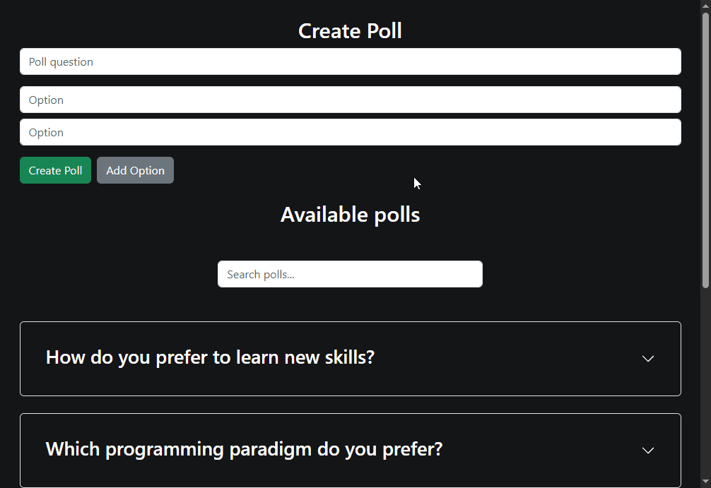

# Voting App (Spring Boot + Angular)

This is a **Voting Application** built with **Spring Boot** (backend), **Angular** (frontend), and **MySQL** (database).  
It was created **for training and learning purposes** – to practice full-stack development, pagination, search, and Docker basics.  

---

## 🚀 Demo

  


---

## ⚙️ Tech Stack

- **Backend:** Java + Spring Boot  
- **Frontend:** Angular  
- **Database:** MySQL (Dockerized via docker-compose)  
- **Build Tool:** Maven  
- **Package Manager:** npm  

---

## 📦 Installation & Setup

### 1. Clone the Repository
```bash
git clone https://github.com/KostisGrf/voting-app.git
cd voting-app
```

### 2. Start MySQL with Docker Compose
Make sure you have `docker-compose.yml` in the root folder.  
Then run:

```bash
docker-compose up -d
```

### 4. Run the backend
```bash
mvn spring-boot:run
```
backend runs at:
```bash
http://localhost:8080
```

### 4. Frontend (Angular)
Navigate to the frontend folder:
```bash
cd client
npm install
ng serve
```
frontend runs at:
```bash
http://localhost:4200
```
## ✅ Features

- Create polls with multiple options  
- Vote once per poll (tracked via local storage)  
- Pagination & Sorting for polls  
- Search by question  
- Responsive UI with Bootstrap
